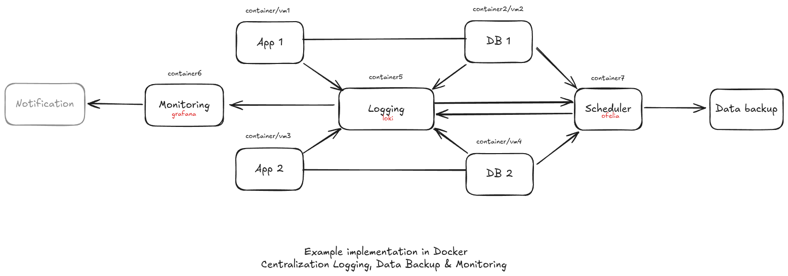

### Centralization Logging and Backup Data

A Docker-based implementation for a centralized infrastructure. This setup ensures that application logs, database backups, and system monitoring are managed from a single, unified pipeline.